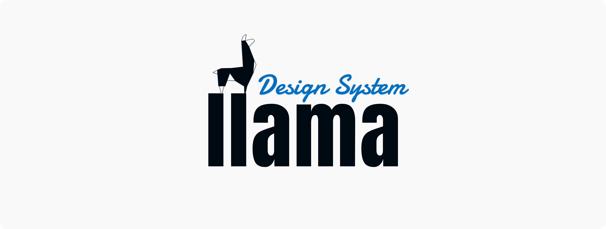

<p style="background: #fff; border-radius: 8px;" align="center">
  
</p>

[](https://lerna.js.org/)
[](https://github.com/emotion-js/emotion)
[](https://www.npmjs.com/package/@llama-ui/react)

This project contains my registry packages using

- Lerna
- Emotion
- Jest
- Typescript

## Install

```bash
yarn add @llama-ui/react
```

## Usage

```tsx
// app.tsx
import React from "react";
import { ThemeProvider } from "@llama-ui/react";

const App = () => {
  return <ThemeProvider>// your code</ThemeProvider>;
};

export default App;
```

## setting our theme in your project

```tsx
// styles/styled.d.ts
import "@emotion/react";
import { IThemeCustom } from "@llama-ui/react";

declare module "styled-components" {
  export interface DefaultTheme extends IThemeCustom {}
}
```

## Packages

| Project | Package                                              | Version                                                                                                         | Docs                                                                                            |
| ------- | ---------------------------------------------------- | --------------------------------------------------------------------------------------------------------------- | ----------------------------------------------------------------------------------------------- |
| React   | [`React`](https://npmjs.com/package/@llama-ui/react) | [](https://npmjs.com/package/@llama-ui/react) | [](packages/React/README.md) |
| Theme   | [`Theme`](https://npmjs.com/package/@llama-ui/theme) | [](https://npmjs.com/package/@llama-ui/theme) | [](packages/Theme/README.md) |
